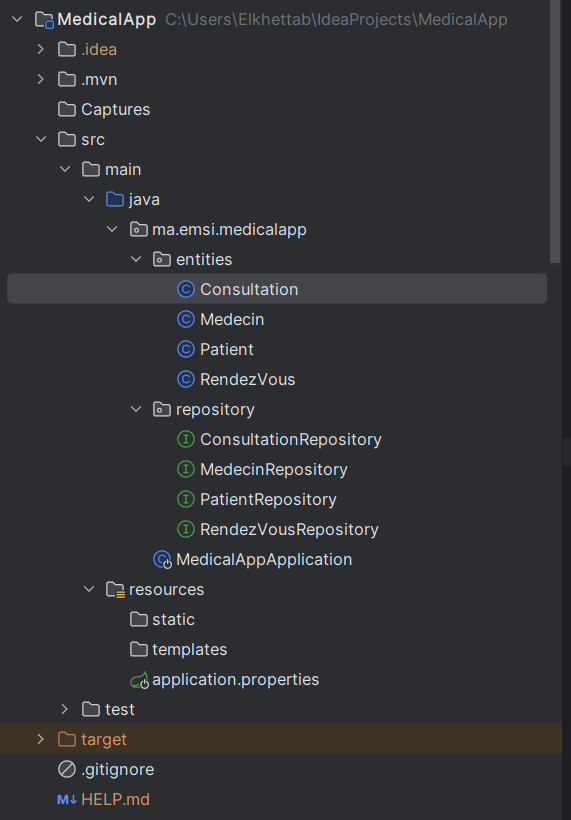
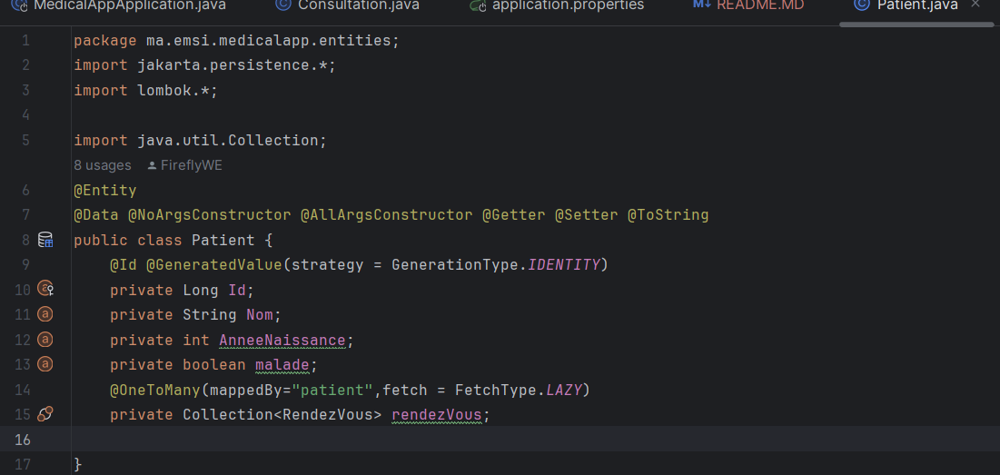
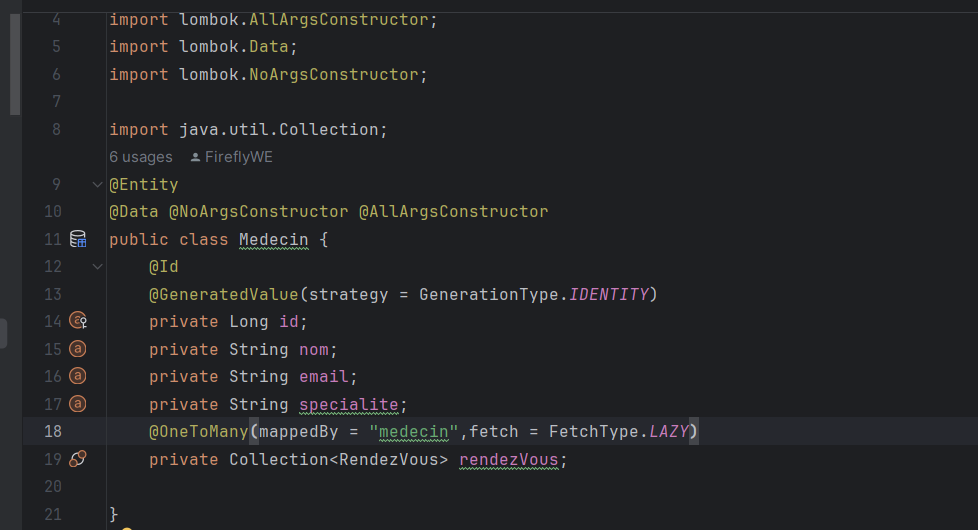
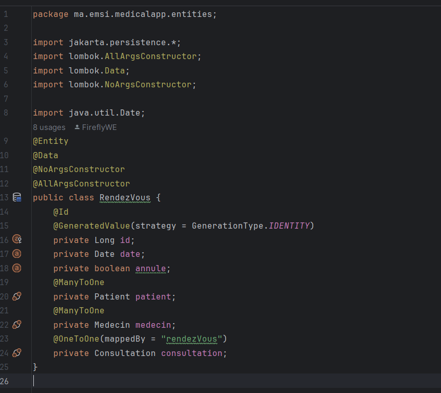
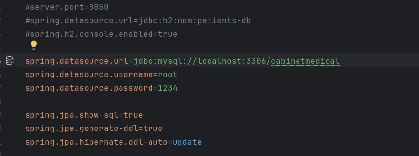
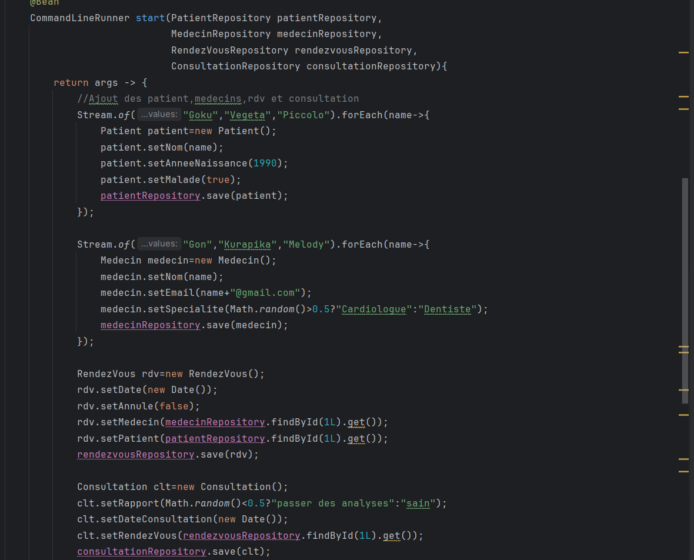
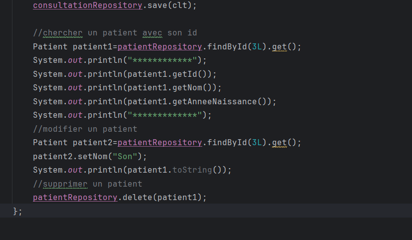

<h1>Compte rendu App Medical</h1>
<h2>Objectif</h2>

L'objectif de ce tp est de créer une application de gestion du cabinet medical en gérant 
<i>les patients,les medecins,les rendez-vous et les consultations</i>.
En stockant les données sur MySQL.

<h2>Architecture du projet</h2>

<h2>Les classes:</h2>
<h3>Patient</h3>

<h3>Medecin</h3>

<h3>Rendez-Vous</h3>

<h3>Consultation</h3>

<h2>Implementation H2 et MySQL</h2>

<h2>Implementation des méthodes:</h2>

