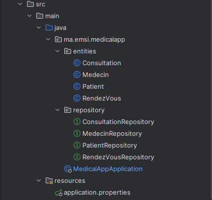
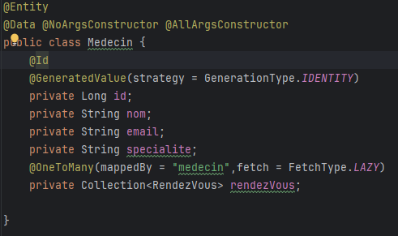
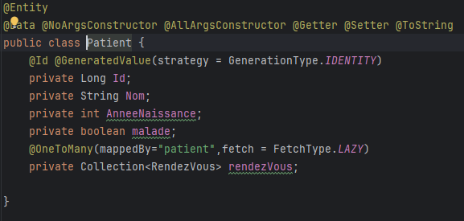
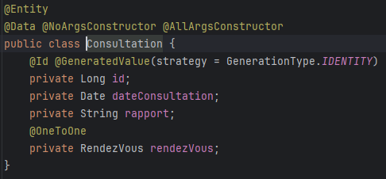
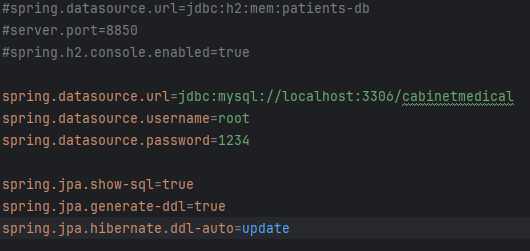
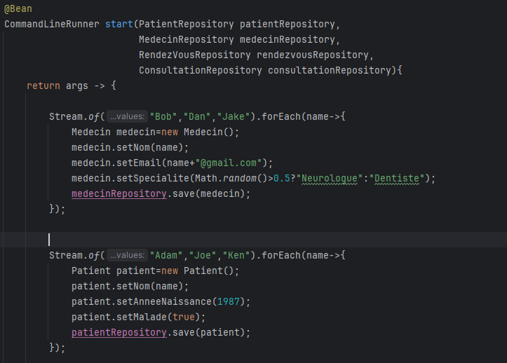
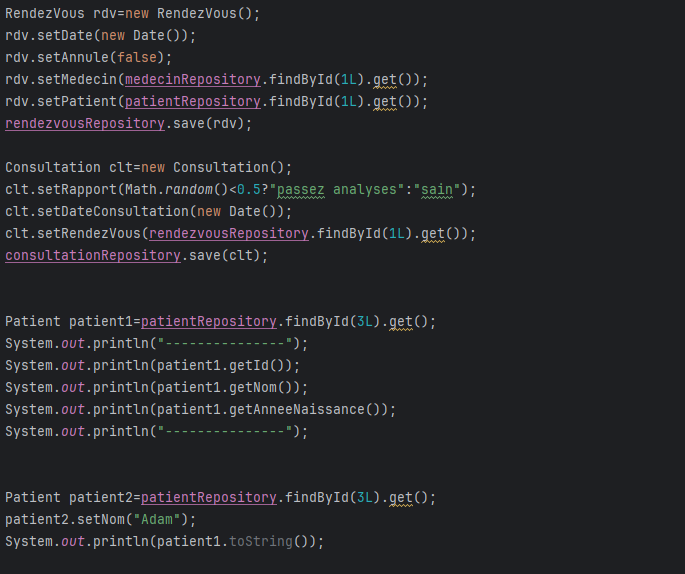

<h1>Compte rendu TP2</h1>
<h2>Objectif:</h2>

Créer une application de gestion medical pour gérer
les patients,les medecins,les rendez-vous et les consultations en les stockant dans une database MYSQL.

<h2>Architecture du projet</h2>

<h2>Les classes:</h2>
<h3>Medecin</h3>

<h3>Patient</h3>

<h3>Consultation</h3>

<h2>App properties</h2>

<h2>Implementation méthodes:</h2>

